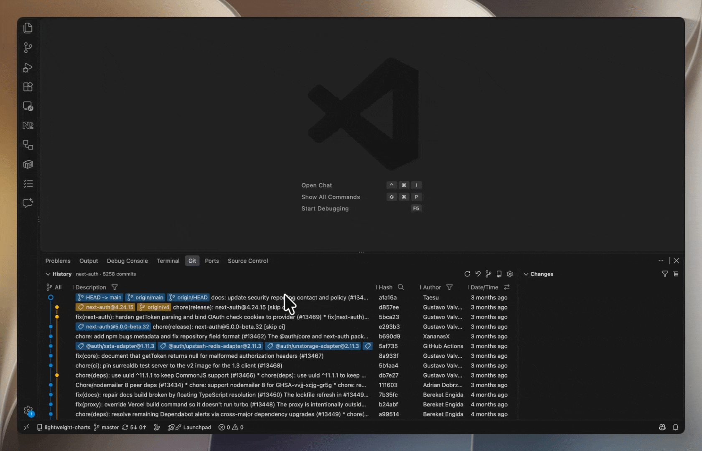
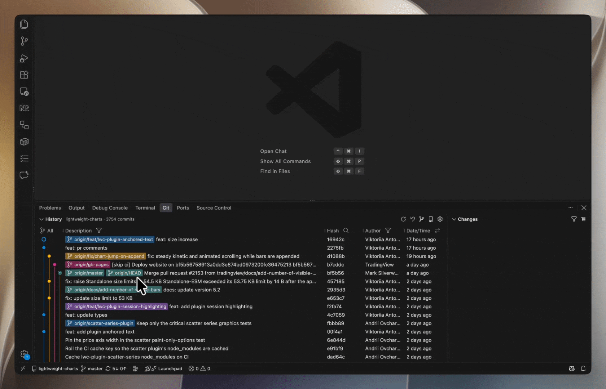
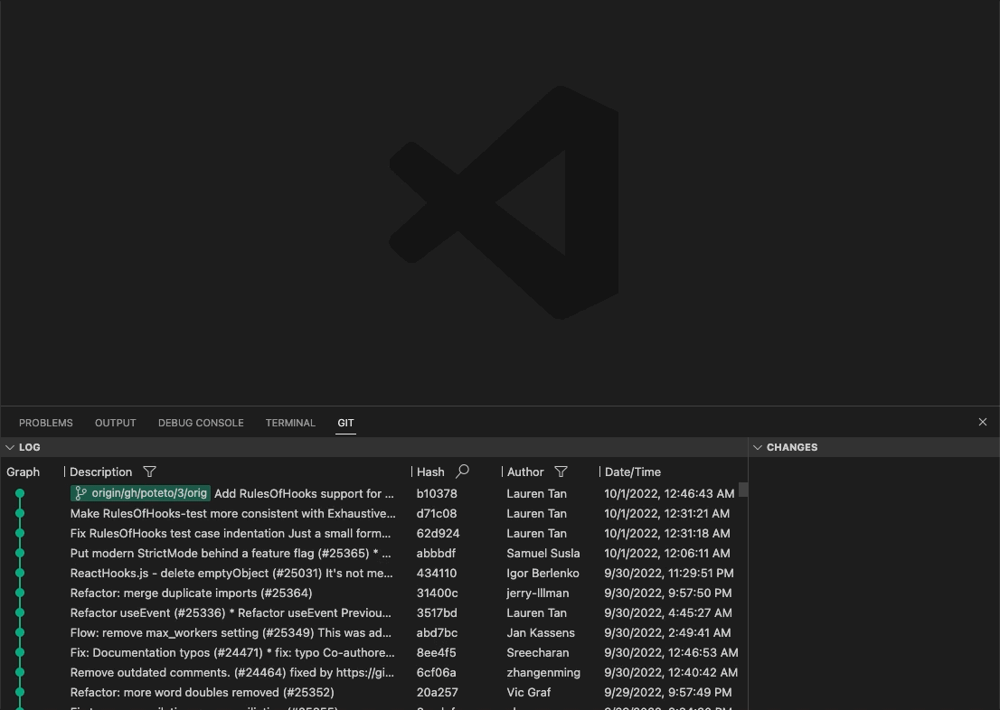

# Git History

English | [简体中文](./README.zh-CN.md)

The extension provides a visual git history panel to help you browse git history easily.

It brings the following main features

🗞️ Full git history

🩺 Diff batch commits

〽️ Commit chain graph

🔍 Quick search

## Usage

### Git History

- Scroll once to see all commits in git history even if the amount of commits is huge

### Commit Changes

- Click a commit to check the changes
- Select multiple commits with `Ctrl`/`⌘` pressed,and then you will see the merged changes from the selected commits
- Drag through the commits to quickly select them
- Right click a changed file for `Open Changes`, `Open File at Commit`, `Copy Path`, `Copy Relative Path`, `Open Containing Folder` and `Open in Integrated Terminal` (`Ctrl`/`⌘`-click to select several files and copy their paths at once)

### Commit Actions

Right click a commit to act on it, right click a tag to manage it:

- Copy the commit hash or message
- Create a branch at the commit and switch to it
- Add a tag at the commit
- Cherry-pick / revert the commit
- Check out the commit in a detached HEAD
- Reset the current branch to the commit (`soft` / `mixed` / `hard`)

### Commit Chain Graph

### Others

- Search for hash in all commits and navigate to the location
- Filter the commits by authors/message
- Switch to another branch or repo in your workspace
- Drag the header to set a comfortable size for columns
- And more,coming soon..

## Release History

See [CHANGELOG.md](CHANGELOG.md).
