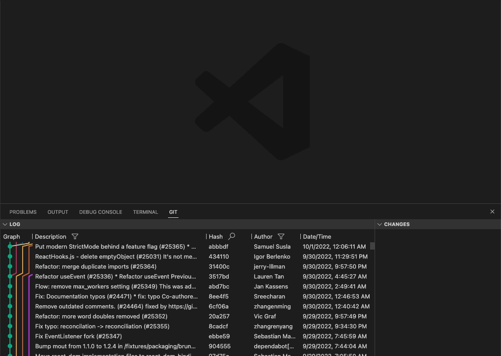
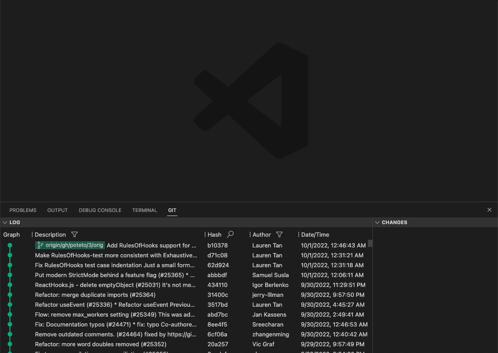

# Git History

[English](README.md) | 简体中文

一个更方便的查看Git历史的插件

具备以下主要功能

🗞️ 全量的Git历史展示

🩺 批量对比多个commit

〽️ 图形

🔍 快速搜索

## 操作指南

### Git 历史

- 一次滚动查看所有git历史

### Commit 变更

- 点击commit可在变更栏查看变更
- 按住 `Ctrl`/`⌘` 可选中多个commit,你可以查看这多个commit合并后的变更
- 通过拖动来快速选择多个连续的commit

### 图形

### 其他

- 可以通过搜索hash来快速定位到对应的commit
- 通过作者或者信息来过滤历史
- 可查看其他分支与仓库历史
- 拖动表头来控制各列的可视宽度
- 更多功能开发中

## 发布历史

查看 [CHANGELOG.md](CHANGELOG.md).
